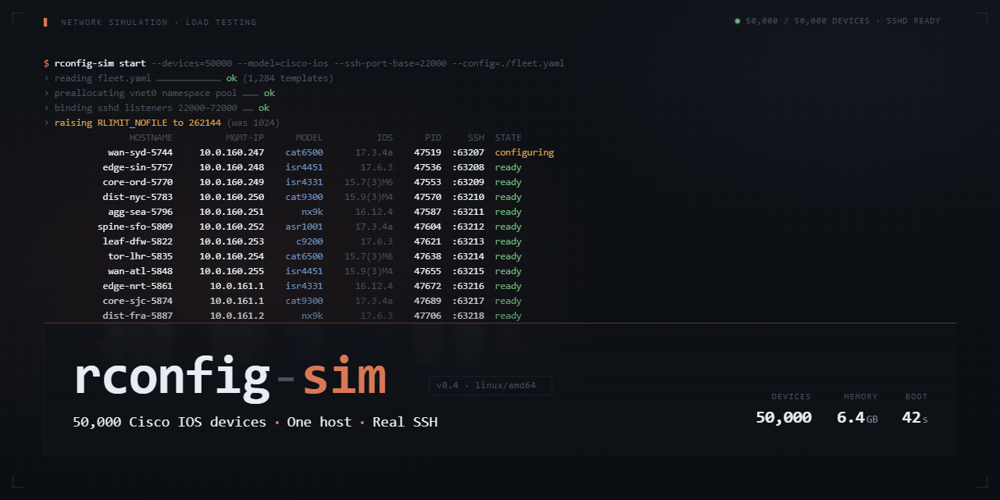

<div align="center">


# rconfig-sim

**A high-density Cisco IOS SSH simulator for load testing [rConfig](https://www.rconfig.com) at scale.**



Stand up 50,000 fake network devices on a single Linux host. Each one speaks real SSH, serves realistic multi-KB to multi-MB running-configs, and responds exactly like Cisco IOS — enough to exercise rConfig's scheduler, collectors, parser, diff engine, and storage pipeline under production-shaped load.

[](https://github.com/rconfig/rconfig-sim/actions/workflows/ci.yml)
[](https://www.rconfig.com/rconfig-sim)
[](https://go.dev/)
[](LICENSE)
[]()
[]()
[](https://claude.com/claude-code)

**[Project website →](https://www.rconfig.com/rconfig-sim)**

[Quickstart](#quickstart) · [Architecture](#architecture) · [Deployment](#full-deployment) · [Operations](#operational-runbook) · [Metrics](#metrics-reference) · [Faults](#fault-injection) · [Troubleshooting](#troubleshooting)

</div>

---

## Table of Contents

- [What this is and isn't](#what-this-is-and-isnt)
- [Why](#why)
- [Features](#features)
- [Architecture](#architecture)
- [Performance characteristics](#performance-characteristics)
- [Prerequisites](#prerequisites)
- [Quickstart](#quickstart)
- [Full deployment](#full-deployment)
- [Operational runbook](#operational-runbook)
- [Fault injection](#fault-injection)
- [Metrics reference](#metrics-reference)
- [Configuration templates](#configuration-templates)
- [CLI reference](#cli-reference)
- [Testing](#testing)
- [Troubleshooting](#troubleshooting)
- [Known limitations](#known-limitations)
- [Roadmap](#roadmap)
- [Contributing](#contributing)
- [License](#license)

---

## What this is and isn't

**It is:** a purpose-built Go SSH server that emulates Cisco IOS devices well enough to satisfy rConfig's standard collection flow. It is designed to run at extreme density — tens of thousands of listeners on a single host — with bounded memory, zero-copy config delivery, and realistic timing characteristics. It emits Prometheus metrics covering session lifecycle, throughput, and fault activity. It supports deliberate fault injection to exercise rConfig's error handling paths.

**It isn't:** a full Cisco IOS emulator, a network topology simulator (no routing, no data plane, no control plane), or a replacement for GNS3/EVE-NG/Containerlab. It doesn't do SSH key auth, VRF separation, or anything past the ten-or-so commands rConfig actually issues. The point is to load-test an NMS, not to run virtual labs.

If you need to validate rConfig's behaviour against 50,000 devices without spending $2M on real hardware or burning a datacentre on VM emulation, this is the tool.

---

## Why

Real-world rConfig deployments span from a hundred devices to tens of thousands. The bugs that surface at 50 devices are not the bugs that surface at 50,000:

- **Scheduler fairness** — does the queue starve when a handful of slow devices block workers?
- **Burst handling** — what happens when an ad-hoc "pull everything now" runs against the full fleet?
- **Diff engine scaling** — does snapshot storage and comparison hold up at 50k × 100 revisions?
- **Retry and backoff logic** — when 2% of devices return auth failures intermittently, does rConfig behave?
- **Resource envelopes** — how much RAM, CPU, disk, and DB I/O does 50k actually cost?

You cannot answer any of these with unit tests or a lab of ten devices. You need realistic load. rconfig-sim is how you get it.

---

## Features

- **50,000+ concurrent SSH listeners** on a single commodity host (12 vCPU / 48 GB reference spec)
- **Real SSH** via `golang.org/x/crypto/ssh` — not a mock, not a protocol approximation
- **Zero-copy config delivery** via mmap — responding with a 5 MB config allocates nothing on the hot path
- **Realistic Cisco IOS output** across four size buckets (30 KB to 5 MB) with parameterised hostnames, ACLs, interfaces, routing, and AAA stanzas
- **Deterministic generation** — same seed produces byte-identical configs, reproducible across runs
- **Prometheus metrics** with bounded label cardinality (verified by test)
- **Fault injection** — four independent fault types (auth_fail, disconnect_mid, slow_response, malformed) with per-session RNG and verified zero overhead when disabled
- **Systemd-native operation** — one service instance per IP, independent restart, drain, and log streams
- **Cisco-style command parsing** — prefix matching (`sh run` → `show running-config`), ambiguity detection, enable mode, deterministic serial numbers
- **Fully static binaries** — `CGO_ENABLED=0`, no runtime dependencies beyond glibc 2.34
- **36 runnable manual test samples** covering every feature path

---

## Architecture

### High-level topology

```
                    ┌─────────────────────────────────────────┐
                    │           rConfig server                │
                    │   (scheduler, collectors, DB, UI)       │
                    │                                         │
                    │   Imports manifest.csv → 50k devices    │
                    └──────────────────┬──────────────────────┘
                                       │
                                       │ SSH (20 IPs × 2500 ports)
                                       │
                    ┌──────────────────▼──────────────────────┐
                    │          rconfig-sim host               │
                    │                                         │
                    │  ┌───────────────────────────────────┐  │
                    │  │ 20 × systemd rcfg-sim@IP units    │  │
                    │  │                                   │  │
                    │  │ rcfg-sim@10.50.0.1  → 10000-12499 │  │
                    │  │ rcfg-sim@10.50.0.2  → 10000-12499 │  │
                    │  │         ...                       │  │
                    │  │ rcfg-sim@10.50.0.20 → 10000-12499 │  │
                    │  └───────────────────────────────────┘  │
                    │                                         │
                    │  Each process:                          │
                    │   • mmap's its 2500 configs             │
                    │   • Listens on 2500 ports               │
                    │   • Exposes /metrics on admin port      │
                    │                                         │
                    │  Shared state:                          │
                    │   • /opt/rcfg-sim/configs/*.cfg         │
                    │   • /opt/rcfg-sim/manifest.csv          │
                    │   • /etc/rcfg-sim/<IP>.env              │
                    └─────────────────────────────────────────┘
                                       │
                                       │ Prometheus scrape
                                       │
                    ┌──────────────────▼──────────────────────┐
                    │        Monitoring host (separate)       │
                    │        Prometheus + Grafana             │
                    └─────────────────────────────────────────┘
```

### Per-process internals

```
  ┌─────────────────────────────────────────────────────────────┐
  │                      rcfg-sim process                       │
  │                                                             │
  │   ┌───────────────┐                                         │
  │   │  main.go      │ parses CLI, wires components,           │
  │   │               │ installs signal handlers                │
  │   └───────┬───────┘                                         │
  │           │                                                 │
  │   ┌───────▼───────┐       ┌──────────────────────┐          │
  │   │ configs/      │◄──────┤ manifest.csv         │          │
  │   │ loader.go     │       │ (port → config path) │          │
  │   │               │       └──────────────────────┘          │
  │   │ mmap all 2500 │                                         │
  │   │ configs once  │                                         │
  │   └───────┬───────┘                                         │
  │           │                                                 │
  │           │  []byte views keyed by port                     │
  │           │                                                 │
  │   ┌───────▼───────┐                                         │
  │   │ sshsrv/       │                                         │
  │   │ server.go     │ spawns 2500 net.Listen goroutines       │
  │   │               │ each: for { c := Accept(); go handle }  │
  │   └───────┬───────┘                                         │
  │           │                                                 │
  │           │  per-connection                                 │
  │           │                                                 │
  │   ┌───────▼───────┐       ┌──────────────────────┐          │
  │   │ sshsrv/       │◄──────┤ fault/inject.go      │          │
  │   │ session.go    │       │ per-session *rand    │          │
  │   │               │       └──────────────────────┘          │
  │   │ handshake →   │                                         │
  │   │ shell loop →  │       ┌──────────────────────┐          │
  │   │ dispatch →    │──────►│ metrics/prom.go      │          │
  │   │ write bytes   │       │ bounded labels       │          │
  │   └───────┬───────┘       └──────────────────────┘          │
  │           │                          │                      │
  │           │                          │                      │
  │           ▼                          ▼                      │
  │   ┌───────────────┐         ┌────────────────┐              │
  │   │ sshsrv/       │         │ HTTP :9100     │              │
  │   │ dispatch.go   │         │ /metrics       │              │
  │   │               │         │ /healthz       │              │
  │   │ prefix match, │         └────────────────┘              │
  │   │ Cmd* enum,    │                                         │
  │   │ zero-copy out │                                         │
  │   └───────────────┘                                         │
  └─────────────────────────────────────────────────────────────┘
```

### Data flow for a single collection run

```
1.  rConfig scheduler fires → 500 workers pick up jobs
    │
    ▼
2.  Worker opens SSH to 10.50.0.7:11234 (admin/admin)
    │
    ▼
3.  rconfig-sim@10.50.0.7 accepts → handshake → auth
    │    (fault check: auth_fail?  no → proceed)
    │    metric: handshake_duration_seconds observed
    │    metric: auth_attempts_total{ok} incremented
    │    metric: active_sessions incremented
    ▼
4.  Shell session opens → prompt "rtr-mad-edge-1234>"
    │
    ▼
5.  Worker sends "terminal length 0" → silent ack
    Worker sends "enable"            → password prompt
    Worker sends "enable123"         → prompt "rtr-mad-edge-1234#"
    Worker sends "show running-config"
    │    (fault check: disconnect_mid, slow_response, malformed?)
    │    dispatch → CmdShowRunningConfig → mmap slice returned
    │    write slice to SSH channel (zero-copy)
    │    metric: bytes_sent_total += len(config)
    │    metric: command_duration_seconds{CmdShowRunningConfig} observed
    ▼
6.  Worker sends "exit" → session closes
    │    metric: session_duration_seconds observed
    │    metric: sessions_total{ok} incremented
    │    metric: active_sessions decremented
    ▼
7.  rConfig stores snapshot, diffs against previous, persists
```

### File layout on disk

```
/opt/rcfg-sim/
├── bin/
│   ├── rcfg-sim              # SSH server binary
│   └── rcfg-sim-gen          # config generator binary
├── configs/                  # 50,000 × *.cfg (~19 GB total)
│   ├── device-00000.cfg
│   ├── device-00001.cfg
│   └── ...
├── manifest.csv              # 50,000 rows: hostname,ip,port,creds,...
└── host-keys/                # persistent SSH host keys per IP
    ├── 10.50.0.1.key
    └── ...

/etc/rcfg-sim/
├── 10.50.0.1.env             # per-instance env for systemd
├── 10.50.0.2.env
└── ...

/etc/systemd/system/
└── rcfg-sim@.service         # template unit

/etc/sysctl.d/
└── 99-rcfg-sim.conf          # kernel tuning

/etc/security/limits.d/
└── rcfg-sim.conf             # nofile limits for rcfgsim user
```

---

## Performance characteristics

Measured against the reference VM (12 vCPU Intel i9-9900K, 48 GB RAM, virtio-net multiqueue=8):

| Metric | Value | Notes |
|---|---|---|
| Idle listener memory | ~2 KB | Per listening socket, kernel-side |
| Active session memory | 20–50 MB | Peaks when streaming large configs |
| Handshake throughput | 200–400/sec/core | AES-NI crypto path |
| Dispatch hot path | ~640 ns/op | 3 allocs, fault-disabled |
| Dispatch w/ faults | ~650 ns/op | +2% when rolling, +0.3% when disabled |
| Config memory footprint | ~19 GB | 50k × mean 380 KB, all mmap'd |
| Startup time (2500 listeners) | ~1.2 s | Including host key load + mmap |
| Graceful shutdown | <30 s | Drains in-flight, unmaps, exits |

### What drives cost

- **Handshake CPU**, not session count. 50,000 idle listeners cost ~100 MB total. 500 concurrent new handshakes/sec costs 2–4 cores.
- **Network bytes**, not connection count. 500 concurrent sessions pulling huge configs can briefly burst to 1–2 Gbps.
- **File descriptors**, always. Each listener = 1 FD. Each active session = 3+ FDs. Budget 200,000.

### What doesn't drive cost

- Disk I/O after startup. mmap'd configs stay resident.
- Goroutine count. Go's scheduler handles 50k+ goroutines without strain.
- TLS/crypto beyond handshake. Stream ciphers are cheap once established.

---

## Prerequisites

**OS:** Rocky Linux 9, RHEL 9, AlmaLinux 9, or a recent Debian/Ubuntu. Anything with glibc 2.34+ and a kernel 5.14+.

**Software:**

- Go 1.22 or later (1.26+ recommended)
- `make`
- `systemd` (v250+ for the unit semantics used)
- `iproute2` (for `ip` command used by alias script)
- Root access for install, sysctl, limits, and systemd changes

**Hardware (for full 50k deployment):**

- 12 vCPU minimum (8 workable, 16 comfortable)
- 48 GB RAM minimum (32 workable for steady-state testing only)
- 300 GB disk (SSD preferred, any tier)
- 1 Gbps network (2.5/10 Gbps preferred for burst testing)

**Network:**

- 20 IP addresses available on one interface (aliases work fine — no need for 20 physical NICs)
- Routing path from rConfig host to simulator host
- MTU consistent end-to-end (verify with `ping -M do -s 8972`)

---

## Quickstart

Gets you from empty Rocky 9 VM to a verified working simulator in about ten minutes. This walkthrough runs the binaries **directly** — no systemd, no service install — so you can see how the pieces fit together before committing to the full deployment. Use this to validate the build, prove the SSH flow works end-to-end, and get comfortable with what each component does. For production deployment with systemd, persistent IP aliases, and kernel tuning, skip to [Full deployment](#full-deployment) after completing this.

### 1. Install Go

The binaries are built from source, so you need a recent Go toolchain to compile them. The distro-packaged Go lags significantly behind stable, so install from the official tarball.

```bash
cd /tmp
curl -LO https://go.dev/dl/go1.26.2.linux-amd64.tar.gz
sudo rm -rf /usr/local/go
sudo tar -C /usr/local -xzf go1.26.2.linux-amd64.tar.gz

sudo tee /etc/profile.d/go.sh > /dev/null <<'EOF'
export PATH=$PATH:/usr/local/go/bin
export GOPATH=$HOME/go
export PATH=$PATH:$GOPATH/bin
EOF
sudo chmod +x /etc/profile.d/go.sh
source /etc/profile.d/go.sh

go version
# → go version go1.26.2 linux/amd64
```

### 2. Clone and build

Clones the source and compiles both binaries into `./bin/`. Everything is static (`CGO_ENABLED=0`) — the resulting binaries have no runtime dependencies beyond glibc and can be copied to other hosts freely.

```bash
sudo dnf install -y make git
sudo mkdir -p /opt/src && sudo chown $USER:$USER /opt/src
cd /opt/src
git clone https://github.com/rconfig/rconfig-sim.git
cd rconfig-sim
make build

ls -lh bin/
# → rcfg-sim       11M   (the SSH server)
# → rcfg-sim-gen   3.4M  (the config generator)
```

### 3. Generate a small test set

**What this step does and why it exists.**

The simulator doesn't invent configs at runtime — it serves pre-rendered files from disk via mmap. This step produces 100 realistic Cisco IOS configs (with varied hostnames, interfaces, ACLs, routing, AAA stanzas) plus a **manifest CSV** that maps each device to an IP, port, and credential set.

Two reasons to pre-render rather than generate on the fly:

- **Determinism** — same `--seed` produces byte-identical output across runs, so rConfig regression tests operate against a fixed, reproducible fleet.
- **Zero-copy hot path** — the simulator mmaps each file once at startup and serves the same bytes to every SSH client with no allocation. Runtime templating would destroy that.

The manifest is the bridge between the two halves of the system: the simulator reads it to know which port serves which config, and rConfig imports the same file as its device list. One source of truth, consumed by both sides.

```bash
mkdir -p /tmp/rcfg-test/configs
./bin/rcfg-sim-gen \
  --count 100 \
  --output-dir /tmp/rcfg-test/configs \
  --manifest /tmp/rcfg-test/manifest.csv \
  --ip-base 127.0.0.1 \
  --ip-count 1 \
  --port-start 12000 \
  --devices-per-ip 100 \
  --seed 42

head -3 /tmp/rcfg-test/manifest.csv
# → hostname,ip,port,vendor,template,username,password,enable_password,config_file,size_bucket
# → rtr-msp-hq-1000,127.0.0.1,12000,Cisco,cisco_ios,admin,admin,enable123,/tmp/rcfg-test/configs/device-00000.cfg,medium
# → sw-sea-admin-1001,127.0.0.1,12001,Cisco,cisco_ios,admin,admin,enable123,/tmp/rcfg-test/configs/device-00001.cfg,small
```

You now have 100 config files on disk ranging from ~25 KB (access switches) up to possibly a few MB (DC cores), distributed 40/40/15/5 across small/medium/large/huge size buckets.

### 4. Run the simulator in the foreground

**What this step does and why it's set up this way.**

This starts the SSH server bound to **127.0.0.1** (loopback), listening on ports 12000–12099. It runs as a normal **foreground process** owned by your user — **not** as a systemd service. That's deliberate for this walkthrough: you see the JSON startup log live, ctrl-C stops it, and you iterate quickly without `systemctl`. The full deployment in the next section runs it under systemd with automatic restart, drain, and per-instance supervision — which is the right shape for a 50k-device deployment but overkill for proving the binary works.

**Why loopback?**

- Zero network configuration required — loopback is always up on any Linux host, no IP aliases, no routing, no firewall rules.
- Perfect for validating that the binary works and the SSH flow is functional before introducing any infrastructure complexity.
- Fastest path from "built" to "proven working."

**Accessing the loopback from a remote system (e.g. rConfig running on another host).** Loopback isn't reachable from outside the host. Two options:

1. **SSH port-forward** — from the remote host: `ssh -L 12000:127.0.0.1:12000 sim-host`. This opens a tunnel so `localhost:12000` on your machine reaches the simulator's loopback listener through the SSH connection. Fine for ad-hoc testing a handful of devices.
2. **Bind to a routable interface instead** — change `--listen-ip 127.0.0.1` to the host's external IP (e.g. `--listen-ip 192.168.1.50`). Any host that can route to that IP can then connect directly. This is the shape used in [Full deployment](#full-deployment), with IP aliases to fan out across 20 addresses.

For this quickstart, stay on loopback and test locally.

```bash
./bin/rcfg-sim \
  --listen-ip 127.0.0.1 \
  --port-start 12000 \
  --port-count 100 \
  --configs-dir /tmp/rcfg-test/configs \
  --manifest /tmp/rcfg-test/manifest.csv \
  --host-key /tmp/rcfg-test/hostkey \
  --metrics-addr 127.0.0.1:9100 &

sleep 1
```

Expected log (JSON):

```json
{"time":"...","level":"INFO","msg":"rcfg-sim ready","listen_ip":"127.0.0.1",
 "port_range":"12000-12099","devices_loaded":100,"total_config_bytes":14823912,"pid":12345}
```

`devices_loaded: 100` confirms the manifest parsed correctly and all 100 configs mmapped successfully. If that number is lower than expected, the manifest's IP/port range doesn't match what the simulator was told to bind.

### 5. SSH into a simulated device

Connect to any port in the range (each port is a different simulated device). The server accepts any password when `--password` is empty (default for this quickstart) — match rConfig's credential behaviour to this later.

**Scripted smoke test** — the canonical sequence to prove the full flow (auth → enable → read commands → clean close). Two `exit`s are required: the first leaves enable mode, the second closes the session:

```bash
sshpass -p anything ssh -T \
  -o StrictHostKeyChecking=no -o UserKnownHostsFile=/dev/null \
  admin@127.0.0.1 -p 12000 <<'CMDS'
terminal length 0
enable
enable123
show version
show running-config
exit       # leaves enable mode, drops to user-exec prompt
exit       # closes session cleanly -> sessions_total{result="ok"}
CMDS
```

Output tail should end with `end` (config trailer), `<hostname>#exit`, `<hostname>>exit` — those two final lines are the two-step exit flow. If the second `exit` is omitted, the client's stdin-EOF closes the channel and the server classifies the session as `disconnect` rather than `ok`; that matches real Cisco IOS behaviour (`exit` in enable mode demotes, it does not hang up), not a bug.

**Interactive alternative** — for hands-on exploration. Same two-exit flow applies:

```bash
ssh -o StrictHostKeyChecking=no -o UserKnownHostsFile=/dev/null \
    admin@127.0.0.1 -p 12000

# At the prompt, type:
rtr-msp-hq-1000> enable
Password: enable123
rtr-msp-hq-1000# show version
...
rtr-msp-hq-1000# show running-config
[streams the full config]
rtr-msp-hq-1000# exit              # leaves enable mode
rtr-msp-hq-1000> exit              # closes session
```

If the interactive output looks staircased (lines drifting right), that's an OpenSSH pty rendering quirk — the config file uses LF line endings, which is what rConfig expects. See [Troubleshooting](#troubleshooting) for the clean-output test using `sshpass` or `ssh -T`.

### 6. Scrape metrics

**What this step does and why it exists.**

The simulator exposes Prometheus metrics at `/metrics` on the address given by `--metrics-addr`. This is how you observe the simulator's behaviour during a load test — session counts, durations, bytes streamed, fault activations, auth outcomes. Step 5 generated real traffic; now we check the metrics reflect it.

**Two ways to use this endpoint:**

- **Manual spot-checks** (what we're doing here) — `curl` and grep the plain-text output to confirm specific counters moved. Good for smoke testing, debugging, and quick "is it working?" checks during development.
- **Prometheus + Grafana integration** (production) — a Prometheus server scrapes `/metrics` from every simulator instance (all 20 in the full deployment) every 15 seconds, stores the time series, and Grafana renders dashboards showing queue pressure, latency percentiles, fault activity, per-IP load distribution, and correlation with rConfig's own queue metrics on a shared time axis. This is how you actually run a load test campaign and interpret the results. See [Metrics reference](#metrics-reference) for recommended dashboards and example PromQL queries.

```bash
curl -s http://127.0.0.1:9100/metrics | grep -E '^rcfgsim_' | head -20
```

Expected: 8 `rcfgsim_*` metric families. Specifically after step 5 you should see non-zero values for:

- `rcfgsim_sessions_total{result="ok"} 1`
- `rcfgsim_auth_attempts_total{result="ok"} 1`
- `rcfgsim_bytes_sent_total <large number matching the config size>`

> **Note:** If the step-5 sequence omits the second `exit`, the session will close via EOF and be classified as `disconnect` rather than `ok` — that's correct Cisco IOS behaviour, not a bug. The second `exit` is what turns a `disconnect` into an `ok`.
- `rcfgsim_command_duration_seconds_count{command="CmdShowRunningConfig"} 1`

If those moved, the full path works end-to-end: SSH handshake → auth → command dispatch → zero-copy write → metrics observation → graceful close.

### 7. Clean up

**What this step does and why.**

The simulator was started as a backgrounded job (`&` at the end of step 4), so stop it explicitly and remove the test artifacts. Nothing at the system level was modified during this walkthrough — no users created, no files installed to `/opt` or `/etc`, no systemd units registered, no sysctl applied. Everything lived in your source directory and `/tmp/`. That's the point of running the binary directly: reversible, self-contained, safe to throw away.

```bash
kill %1              # stop the backgrounded simulator
wait 2>/dev/null     # wait for it to actually exit
rm -rf /tmp/rcfg-test

# Confirm nothing is left listening
ss -tlnp | grep 12000
# → (no output — all ports released)
```

**Where to go next:**

- If this worked, you've proven the binaries function end-to-end. Move to [Full deployment](#full-deployment) to set up the production 50k-device configuration with systemd supervision, persistent IP aliases, kernel tuning, and fault injection wired into env files.
- If anything failed, check [Troubleshooting](#troubleshooting) for the common culprits: port bind failures (IP alias missing), FD exhaustion (ulimits), staircase output (pty rendering), and SELinux denials.

---

## Full deployment

Deployment sequence for a production 50k-device simulator host. Unlike the quickstart (which ran a foreground process bound to loopback), this sets up the real operational shape: a dedicated service account, 20 systemd instances bound to 20 IP aliases, kernel tuning for high-density network workloads, and a generated manifest ready for rConfig to import as a device inventory.

**What you'll have at the end:** a simulator host running 50,000 fake Cisco IOS devices across 20 IP addresses, independently restartable per IP, emitting Prometheus metrics, ready for rConfig to poll.

### Overview

1. System prep (user, packages, SELinux, firewall)
2. Build and install binaries
3. Apply sysctl and limits
4. Configure IP aliases
5. Generate device configs
6. Create per-instance env files
7. Enable and start systemd units
8. Verify end-to-end
9. Import manifest into rConfig

### 1. System prep

**Purpose.** Create the dedicated service user the simulator will run as, the directory layout it expects, and the host-level loosenings that a lab test bed needs (SELinux permissive, firewalld off). None of these are optional for the simulator to function — but they're isolated from the binaries themselves, so they're done up front once and never revisited.

**Why a dedicated user.** The simulator doesn't need root. Running it as `rcfgsim` with `NoNewPrivileges` and a sandboxed systemd unit means even if something catastrophic went wrong, the blast radius is contained to its own directory tree. Good practice regardless of threat model.

**Why SELinux permissive / firewalld off.** This is a test bed, not a production service. SELinux will object to the simulator binding thousands of non-standard ports and opening hundreds of thousands of file descriptors; writing policy for that is wasted effort. Firewalld would need 20+ rules per IP; pointless on an isolated lab host. Both can be re-enabled if you're deploying this onto a hardened host — it's just out of scope for v1.

```bash
# Dev tools and dependencies
sudo dnf groupinstall -y "Development Tools"
sudo dnf install -y git make vim tmux htop tcpdump iproute-tc

# Dedicated service user (no shell, no home login)
sudo useradd -r -s /sbin/nologin -d /opt/rcfg-sim rcfgsim

# Runtime directories
sudo mkdir -p /opt/rcfg-sim/{bin,configs,host-keys}
sudo mkdir -p /etc/rcfg-sim
sudo chown -R rcfgsim:rcfgsim /opt/rcfg-sim
sudo chown root:rcfgsim /etc/rcfg-sim
sudo chmod 750 /etc/rcfg-sim

# SELinux permissive (test bed only)
sudo setenforce 0
sudo sed -i 's/^SELINUX=enforcing/SELINUX=permissive/' /etc/selinux/config

# Firewalld off (lab box)
sudo systemctl disable --now firewalld

# Proxmox guest agent (if running under PVE — nicer shutdown + IP reporting)
sudo dnf install -y qemu-guest-agent
sudo systemctl enable --now qemu-guest-agent
```

### 2. Build and install

**Purpose.** Compile the binaries from source and place them into their runtime locations along with the systemd unit file and tuning configs. After this step, the simulator is installed but not running — nothing has been enabled or started yet.

**Why split build and install.** `make build` produces binaries under `./bin/` owned by your user, which you can iterate on freely without sudo. `sudo make install` copies them to `/opt/rcfg-sim/bin/` and registers the systemd unit. Keeping the two separate means you can rebuild and test in-place without touching system state, and roll a new binary across the fleet with a single install + restart cycle.

**Why `make install` doesn't auto-start anything.** Operator discretion. You might want to apply sysctl first, regenerate configs, change env vars — forcing auto-start would fight all of that. `systemctl daemon-reload` is run so the unit is registered and can be started by hand or by the operator's configuration management.

```bash
cd /opt/src/rconfig-sim
make build
sudo make install
```

`make install` places:

- `/opt/rcfg-sim/bin/rcfg-sim` — the SSH server binary
- `/opt/rcfg-sim/bin/rcfg-sim-gen` — the config generator binary
- `/etc/systemd/system/rcfg-sim@.service` — template unit, one instance per IP
- `/etc/sysctl.d/99-rcfg-sim.conf` — kernel tuning (applied in the next step)
- `/etc/security/limits.d/rcfg-sim.conf` — FD limits for the `rcfgsim` user

And runs `systemctl daemon-reload` but **does not** enable or start any units. That's operator-directed in step 7.

### 3. Apply kernel tuning

**Purpose.** Raise kernel limits that will otherwise cap the simulator long before it reaches target density. Defaults on a stock Rocky install are sized for a typical web server, not a host binding 50,000+ listening sockets.

**What actually changes and why it matters:**

- `fs.file-max = 2000000` — system-wide FD ceiling. With 50k listeners + thousands of active sessions, the default 8192 runs out in seconds.
- `net.core.somaxconn = 65535` — accept queue depth. A burst of new connections can overflow the default 4096 and cause refused connects that look like simulator bugs.
- `net.ipv4.ip_local_port_range = 1024 65535` — ephemeral port range. Not critical for the listening side but matters when the simulator itself initiates outbound connections (it doesn't today, but harmless to widen).
- `net.ipv4.tcp_tw_reuse = 1` — aggressive TIME_WAIT reclaim. rConfig opens and closes sessions rapidly; without this, ports pile up in TIME_WAIT and new sessions can fail under sustained load.
- `neigh.default.gc_thresh*` — ARP table sizing, only relevant if you put aliases on a non-loopback interface. Cheap to raise defensively.

Limits (`nofile = 200000`) apply per-user and are consumed by new login sessions and by the systemd unit's `LimitNOFILE`. The systemd unit already sets this explicitly, so even if your interactive shell still has the old limit, the service itself will have the correct value.

```bash
sudo sysctl --system

# Verify a few values took effect
sysctl fs.file-max net.core.somaxconn net.ipv4.ip_local_port_range
# → fs.file-max = 2000000
# → net.core.somaxconn = 65535
# → net.ipv4.ip_local_port_range = 1024 65535
```

Reboot is not required — all sysctl settings are live immediately. For interactive use of `rcfg-sim` outside systemd, log out and back in so the new ulimit takes effect.

### 4. Configure IP aliases

**Purpose.** The simulator listens on 20 different IP addresses to distribute load across instances and give each its own metrics endpoint, port range, and failure domain. Each IP is bound as an **alias** on a single interface — there's no need for 20 physical NICs or 20 VMs.

**Why 20 IPs rather than one IP with all 50,000 ports on it?** Three reasons:
- **Fault isolation** — one instance crashing or restarting affects only 2,500 devices, not all 50,000.
- **Metrics granularity** — each instance exposes its own `/metrics` endpoint, so Grafana can show per-IP load distribution (useful for spotting uneven scheduler behaviour in rConfig).
- **Operational simplicity** — bouncing one slice is `systemctl restart rcfg-sim@10.50.0.7`, not a whole-fleet operation.

**Why loopback vs a routable interface.** Two choices:

- **Loopback (`lo`):** Simplest, no ARP, no neighbour table concerns, no external reachability. Use this when rConfig runs on the **same host** as the simulator (fine for functional testing) or when you use SSH tunnels to reach the simulator from elsewhere.
- **Routable interface (`eth0` or similar):** Required when rConfig runs on a **different host** and needs direct network reachability. The aliases appear on the wire with their own ARP entries; other hosts on the same L2 segment can connect to them directly.

The examples below use `lo`. If rConfig runs on another box, swap `--interface lo` for `--interface eth0` (or whatever your primary interface is).

```bash
# For same-host setups (loopback)
sudo /opt/rcfg-sim/deploy/ip-aliases.sh --interface lo --base-ip 10.50.0.1 --count 20

# For off-host rConfig (primary interface)
# sudo /opt/rcfg-sim/deploy/ip-aliases.sh --interface eth0 --base-ip 10.50.0.1 --count 20

# Verify all 20 are up
ip addr show lo | grep 10.50
# → inet 10.50.0.1/32 scope global lo
# → inet 10.50.0.2/32 scope global lo
# → ... (up to 10.50.0.20)
```

Removal:

```bash
sudo /opt/rcfg-sim/deploy/ip-aliases.sh --interface lo --base-ip 10.50.0.1 --count 20 --remove
```

**Persistence across reboots.** These aliases do not survive reboot by default. For a persistent setup, wire them into a systemd oneshot unit that runs before `rcfg-sim@*.service`:

```ini
# /etc/systemd/system/rcfg-sim-aliases.service
[Unit]
Description=rconfig-sim IP aliases
Before=rcfg-sim@.service
After=network-online.target

[Service]
Type=oneshot
ExecStart=/opt/rcfg-sim/deploy/ip-aliases.sh --interface lo --base-ip 10.50.0.1 --count 20
ExecStop=/opt/rcfg-sim/deploy/ip-aliases.sh --interface lo --base-ip 10.50.0.1 --count 20 --remove
RemainAfterExit=yes

[Install]
WantedBy=multi-user.target
```

Then `sudo systemctl enable --now rcfg-sim-aliases` and the aliases come up automatically on every boot.

### 5. Generate device configs

**Purpose.** Produce the 50,000 Cisco IOS config files the simulator will serve, plus the manifest CSV that both the simulator and rConfig consume. This is the same tool and process from quickstart step 3, just at full scale and writing to the production paths.

**What you're actually generating.** A mix of small (access switch), medium (aggregation router), large (core router), and huge (DC core / firewall replacement) configs across 200 fictional sites with unique hostnames, serial numbers, interface counts, ACL entries, and routing configuration. The distribution defaults to `small:40,medium:40,large:15,huge:5` which approximates a typical enterprise fleet — override if you want stress-test a specific profile (e.g. `huge:50` to push diff and storage limits).

**Why run as the `rcfgsim` user.** The files need to be readable by the simulator process, which runs as `rcfgsim`. Running the generator as root leaves files with ambiguous ownership; running as your own user means the simulator can't read them. Doing it as `rcfgsim` directly avoids both problems.

**Expected duration.** ~8 minutes on 12 cores (parallel generation, scales linearly with core count). Uses ~19 GB on disk. The huge configs dominate — 5% of files but ~40% of bytes.

```bash
sudo -u rcfgsim /opt/rcfg-sim/bin/rcfg-sim-gen \
  --count 50000 \
  --output-dir /opt/rcfg-sim/configs \
  --manifest /opt/rcfg-sim/manifest.csv \
  --ip-base 10.50.0.1 \
  --ip-count 20 \
  --port-start 10000 \
  --devices-per-ip 2500 \
  --seed 42 \
  --distribution "small:40,medium:40,large:15,huge:5"
```

Expected output:

```
Generated 50000 devices in 7m42s
  small:  20000 (40.00%, avg 25 KB)
  medium: 20000 (40.00%, avg 188 KB)
  large:   7500 (15.00%, avg 918 KB)
  huge:    2500  (5.00%, avg 3.18 MB)
Total on disk: 19.04 GB
Manifest: /opt/rcfg-sim/manifest.csv (50000 rows)
```

`Δ` values in the per-bucket distribution should be `+0.00 pp` — the generator uses stratified assignment to hit exact ratios, not probabilistic sampling.

### 6. Create per-instance env files

**Purpose.** Each systemd instance needs its own configuration: which IP to bind, which port range, where its host key lives, which fault profile to run. The unit file is a template — all the per-instance variance is supplied via `/etc/rcfg-sim/<IP>.env`.

**Why per-IP env files rather than command-line args in the unit.** Three reasons:
- **Operator edits without touching the unit** — changing fault injection on one IP is `sed` + `systemctl restart`, no unit file churn.
- **Staged rollouts** — you can enable fault injection on one IP, observe, then roll to the next. Each instance is independently configurable.
- **Cleaner diffs** — env files are flat KEY=VALUE, easy to track in version control and compare across instances.

**What each env file contains.** The full set of runtime flags as env vars, read by the systemd unit's `EnvironmentFile=` directive and expanded into the `ExecStart` line. See `/opt/rcfg-sim/deploy/systemd/rcfg-sim-instance.env.sample` for the authoritative documented template.

**Why `PORT_START=10000` for every IP.** Each IP has its own port namespace — `10.50.0.1:10000` and `10.50.0.2:10000` are distinct sockets. Keeping the port range identical across all 20 instances means rConfig's device inventory is predictable (IP changes, port doesn't) and easier to reason about in dashboards and queries.

```bash
for i in $(seq 1 20); do
  IP="10.50.0.$i"

  sudo tee /etc/rcfg-sim/${IP}.env > /dev/null <<EOF
LISTEN_IP=${IP}
PORT_START=10000
PORT_COUNT=2500
MANIFEST=/opt/rcfg-sim/manifest.csv
HOST_KEY=/opt/rcfg-sim/host-keys/${IP}.key
USERNAME=admin
PASSWORD=
ENABLE_PASSWORD=enable123
METRICS_ADDR=${IP}:9100
RESPONSE_DELAY_MS_MIN=50
RESPONSE_DELAY_MS_MAX=500
FAULT_RATE=0.0
FAULT_TYPES=
MAX_CONCURRENT_SESSIONS=5000
LOG_LEVEL=info
EOF
done

sudo chown root:rcfgsim /etc/rcfg-sim/*.env
sudo chmod 640 /etc/rcfg-sim/*.env
```

### 7. Enable and start units

**Purpose.** Register each instance with systemd (so they restart on reboot) and start them running. After this step, the simulator is live and accepting SSH connections on all 20 IPs.

**Why stagger the starts.** Starting all 20 instances simultaneously creates a brief resource spike: 50,000 listening sockets opened, 50,000 configs mmap'd, 20 SSH host keys generated on first boot. On a well-provisioned host it's fine; on a tight box it can trigger transient CPU/IO bursts that make log interpretation harder. A 2-second stagger smooths it out with no operational cost.

**Why `enable --now` vs separate `enable` + `start`.** `enable --now` is idempotent and does both in one call. `enable` alone registers for boot but doesn't start; `start` alone runs now but won't survive reboot. Almost always you want both.

```bash
# Enable and start all 20 instances (staggered)
for i in $(seq 1 20); do
  sudo systemctl enable --now rcfg-sim@10.50.0.$i
  sleep 2
done

# Watch them come up
systemctl list-units 'rcfg-sim@*' --no-pager --state=running
# → Expect 20 active (running)
```

If any instance fails to start, check the journal for that IP:

```bash
sudo journalctl -u rcfg-sim@10.50.0.X -n 20 --no-pager
```

Common first-start causes: IP alias missing (step 4 skipped or `--remove`'d), manifest path wrong (step 5 output elsewhere), FD limit not applied (step 3 skipped).

### 8. End-to-end verification

**Purpose.** Prove the full stack works before handing the manifest to rConfig. Three checks: any device responds to SSH, all metrics endpoints are up, and aggregated state is sane.

**What "works" means at this point.** Simulator is listening on all 20 IPs × 2,500 ports each, every port responds to SSH handshake with the correct per-device hostname, each instance exposes metrics, and the aggregate active session count is zero (no rConfig polling yet).

```bash
# Sanity check: a random device on 5 different IPs should answer
for i in 1 5 10 15 20; do
  PORT=$((10000 + RANDOM % 2500))
  echo "Testing 10.50.0.$i:$PORT"
  timeout 5 ssh -o StrictHostKeyChecking=no -o UserKnownHostsFile=/dev/null \
    admin@10.50.0.$i -p $PORT 'show version' 2>/dev/null | head -3
done
# → Expect 5 × "Cisco IOS Software..." banners

# Full smoke test: auth → enable → read commands → clean close. Two exits
# are required — the first leaves enable mode, the second closes the session.
sshpass -p anything ssh -T \
  -o StrictHostKeyChecking=no -o UserKnownHostsFile=/dev/null \
  admin@10.50.0.1 -p 10000 > /tmp/rcfg-smoke.txt 2>&1 <<'CMDS'
terminal length 0
enable
enable123
show version
show running-config
exit       # leaves enable mode
exit       # closes session cleanly -> sessions_total{result="ok"}
CMDS
tail -5 /tmp/rcfg-smoke.txt
# → Expect: ! / end / <hostname>#exit / <hostname>>exit

# Session classification check after the smoke test.
curl -s http://10.50.0.1:9100/metrics | grep -E '^rcfgsim_sessions_total'
# → Expect rcfgsim_sessions_total{result="ok"} to have incremented by 1.
# Note: if the sequence omits the second exit, the session will close via EOF
# and be classified as "disconnect" rather than "ok" — that's correct Cisco IOS
# behaviour, not a bug.

# All 20 metrics endpoints responding
for i in $(seq 1 20); do
  curl -s -o /dev/null -w "%{http_code} 10.50.0.$i:9100\n" http://10.50.0.$i:9100/healthz
done
# → Expect 20 × "200 10.50.0.X:9100"

# Aggregated active session count across all instances
for i in $(seq 1 20); do
  curl -s http://10.50.0.$i:9100/metrics | grep '^rcfgsim_active_sessions '
done | awk '{sum += $2} END {print "total active:", sum}'
# → Expect 0 (no rConfig polling yet)
```

If all checks pass, the simulator is ready.

### 9. Import manifest into rConfig

**Purpose.** The manifest CSV is rConfig's view of the fleet — 50,000 device entries with hostnames, IPs, ports, credentials, and vendor/template assignments. Importing it registers every simulated device in rConfig's inventory so the scheduler can start polling them.

**Column mapping.** The manifest headers match rConfig's bulk import format directly:

| Manifest column | rConfig field |
|---|---|
| hostname | Device name |
| ip | IP address |
| port | SSH port |
| vendor | Vendor |
| template | Template |
| username | Username |
| password | Password |
| enable_password | Enable password |

**Grouping strategy.** Once imported, assign devices to 4–6 groups by `size_bucket` (the rightmost manifest column). This is how you'll drive realistic test profiles:

- Different groups get different polling frequencies (hot group every 15 min, warm every hour, cold weekly)
- Scheduler fairness bugs surface when a slow group blocks a fast one
- Bucket-based metrics in Grafana show per-size-class latency distributions

rConfig's group assignment UI accepts bulk CSV import of `hostname,group_name` pairs. Generate that from the manifest:

```bash
awk -F',' 'NR>1 {print $1","$NF}' /opt/rcfg-sim/manifest.csv > /tmp/group-assignments.csv
head -3 /tmp/group-assignments.csv
# → rtr-msp-hq-1000,medium
# → sw-sea-admin-1001,small
# → sw-bwi-colo-1002,small
```

Import that into rConfig's group management and kick off your first test poll.

---

## Operational runbook

### Daily health check

```bash
# All units running?
systemctl list-units 'rcfg-sim@*' --no-pager --state=running | wc -l
# → 20

# Any units failed?
systemctl list-units 'rcfg-sim@*' --no-pager --state=failed
# → 0 loaded units listed.

# Aggregate load
for i in $(seq 1 20); do
  curl -s http://10.50.0.$i:9100/metrics | grep -E '^rcfgsim_active_sessions |^rcfgsim_sessions_total'
done | awk 'BEGIN{active=0; total=0} /active_sessions/{active+=$2} /sessions_total.*ok/{total+=$2} END{print "active:", active, "lifetime ok:", total}'
```

### Restart one IP without affecting others

```bash
sudo systemctl restart rcfg-sim@10.50.0.7

# Watch it drain and come back
journalctl -u rcfg-sim@10.50.0.7 -f
```

Graceful drain takes up to 30 seconds depending on in-flight session duration. `TimeoutStopSec=45s` in the unit caps it.

### Roll a new binary across all 20 IPs

```bash
cd /opt/src/rconfig-sim
git pull
make build
sudo make install  # replaces /opt/rcfg-sim/bin/*, daemon-reloads

# Rolling restart, 2 at a time, 10s apart
for i in $(seq 1 20); do
  sudo systemctl restart rcfg-sim@10.50.0.$i &
  if (( i % 2 == 0 )); then wait; sleep 10; fi
done
wait
```

Zero-downtime rollout is not supported — each instance bounces briefly. rConfig's retry logic should absorb this.

### Inspect a live session with tcpdump

```bash
# On the simulator host
sudo tcpdump -i lo -nn 'port 10000' -w /tmp/session.pcap

# In another terminal, trigger a connection
ssh -o StrictHostKeyChecking=no admin@10.50.0.1 -p 10000 exit

# Read back
sudo tcpdump -r /tmp/session.pcap -nn | head -30
```

For SSH payload decryption you'd need the session key — not exposed by the simulator. The metadata (handshake timing, connection lifecycle, RST vs FIN on close) is usually enough.

### Log locations and filtering

All logs go to the systemd journal with `SyslogIdentifier=rcfg-sim@<IP>`.

```bash
# Last 5 minutes across all instances
journalctl _SYSTEMD_UNIT=rcfg-sim@10.50.0.1.service --since "5 min ago"

# Only errors, all instances
journalctl -p err -u 'rcfg-sim@*' --since today

# Follow one instance
journalctl -fu rcfg-sim@10.50.0.1

# Structured field filtering (logs are JSON)
journalctl -u rcfg-sim@10.50.0.1 --output=cat | jq 'select(.level=="ERROR")'
```

### Temporarily enable fault injection on one IP

Useful for localised testing without disrupting the fleet.

```bash
# Edit the env file
sudo sed -i 's/^FAULT_RATE=.*/FAULT_RATE=0.05/' /etc/rcfg-sim/10.50.0.3.env
sudo sed -i 's/^FAULT_TYPES=.*/FAULT_TYPES=auth_fail,slow_response/' /etc/rcfg-sim/10.50.0.3.env

sudo systemctl restart rcfg-sim@10.50.0.3

# Watch fault activity
watch -n 2 'curl -s http://10.50.0.3:9100/metrics | grep rcfgsim_faults_injected'
```

Revert by clearing the values and restarting.

### Change config distribution mid-campaign

Requires regenerating configs and restarting all instances.

```bash
# Stop everything
sudo systemctl stop 'rcfg-sim@*'

# Regenerate (new seed if you want different hostnames; same seed for reproducibility)
sudo -u rcfgsim /opt/rcfg-sim/bin/rcfg-sim-gen \
  --count 50000 \
  --output-dir /opt/rcfg-sim/configs \
  --manifest /opt/rcfg-sim/manifest.csv \
  --distribution "small:20,medium:50,large:20,huge:10" \
  --seed 42
# (other flags unchanged from initial generation)

# Restart
for i in $(seq 1 20); do sudo systemctl start rcfg-sim@10.50.0.$i; done
```

Re-import the manifest into rConfig if hostnames changed (different seed). If the seed matches, hostnames and IPs are stable — only content changed.

### Planned teardown

```bash
sudo systemctl stop 'rcfg-sim@*'
sudo systemctl disable 'rcfg-sim@*'
sudo deploy/ip-aliases.sh --interface lo --base-ip 10.50.0.1 --count 20 --remove
sudo make uninstall  # from /opt/src/rconfig-sim
```

Leaves `/opt/rcfg-sim/configs` and `/etc/rcfg-sim/*.env` in place. Remove manually if no longer needed.

---

## Fault injection

Faults exist to exercise rConfig's error handling paths. The four types are independently toggleable and the per-type probability is controlled by `--fault-rate` (or `FAULT_RATE` in env files).

### Fault types

| Type | What it simulates | How rConfig sees it | Effect on zero-copy |
|---|---|---|---|
| `auth_fail` | Bad credentials, rotated password, locked account | SSH auth rejection, identical to real wrong-password | No impact |
| `disconnect_mid` | Device panic, link flap, firewall RST mid-transfer | TCP RST after 20–40% of `show running-config` sent | No impact |
| `slow_response` | Overloaded device, slow CPU, large config parse | Command response arbitrary delayed 10–50× normal (capped 60s) | No impact |
| `malformed` | Device firmware bug, stream corruption, terminal mangling | Output truncated OR junk-line injected OR bit flipped | Allocates on faulting session only |

### Configuration

```bash
# Environment file
FAULT_RATE=0.02
FAULT_TYPES=auth_fail,disconnect_mid,slow_response,malformed

# Command line
rcfg-sim \
  --fault-rate 0.02 \
  --fault-types "auth_fail,disconnect_mid" \
  ...
```

**`FAULT_RATE=0.0`** or **empty `FAULT_TYPES`** disables all fault injection with verified zero overhead on the hot path.

### Fault decision semantics

Each fault is decided **per-event**, not per-session:

- `auth_fail` rolled once per authentication attempt
- `disconnect_mid` rolled once per `show running-config` or `show startup-config` invocation
- `slow_response` rolled once per command response
- `malformed` rolled once per `show running-config` or `show startup-config` invocation

A single session can hit multiple fault types. Each session gets a per-session `*rand.Rand` seeded from session ID + nanosecond timestamp for deterministic-per-session, random-across-fleet behaviour.

### The `slow_response` floor

When `RESPONSE_DELAY_MS_MAX=0` (instant responses by default), `slow_response` has nothing to multiply. To avoid silent no-op configurations, the implementation floors the base delay at 10ms before applying the multiplier. This means a `slow_response` fault with `MAX=0` produces a response delayed 100ms–500ms instead of nothing.

Documented deviation from literal spec, deliberate for operational safety.

### Interpreting fault metrics

```promql
# Fault rate by type (should approximately match --fault-rate × command volume)
rate(rcfgsim_faults_injected_total[5m])

# Sessions ending in disconnect (disconnect_mid + network issues combined)
rate(rcfgsim_sessions_total{result="disconnect"}[5m])

# Auth failures from faults vs real bad passwords
# (subtract one from the other to separate signals)
rate(rcfgsim_faults_injected_total{type="auth_fail"}[5m])
rate(rcfgsim_auth_attempts_total{result="fail"}[5m])
```

---

## Metrics reference

All metrics exposed at `http://<METRICS_ADDR>/metrics`. Scrape interval 15s recommended. All label values are bounded (verified by cardinality test; typical active cardinality ~25 combinations).

### Core metrics

| Metric | Type | Labels | Description |
|---|---|---|---|
| `rcfgsim_active_sessions` | Gauge | — | Sessions currently open |
| `rcfgsim_sessions_total` | Counter | `result` | Completed sessions by outcome (ok/auth_fail/disconnect/error) |
| `rcfgsim_session_duration_seconds` | Histogram | — | Wall time from auth to close, buckets .05s–60s |
| `rcfgsim_command_duration_seconds` | Histogram | `command` | Per-command dispatch time, labelled by Cmd* enum (never user input) |
| `rcfgsim_bytes_sent_total` | Counter | — | Total bytes written to SSH channels |
| `rcfgsim_auth_attempts_total` | Counter | `result` | Auth attempts by outcome (ok/fail) |
| `rcfgsim_handshake_duration_seconds` | Histogram | — | SSH handshake wall time, buckets .01s–2.5s |
| `rcfgsim_faults_injected_total` | Counter | `type` | Fault activations (auth_fail/disconnect_mid/slow_response/malformed) |

Plus standard Go runtime and process metrics via `promhttp`.

### Example Grafana queries

**Session throughput (successful collections per second, fleet-wide):**

```promql
sum(rate(rcfgsim_sessions_total{result="ok"}[1m]))
```

**Error rate as a percentage:**

```promql
sum(rate(rcfgsim_sessions_total{result!="ok"}[5m]))
  / sum(rate(rcfgsim_sessions_total[5m])) * 100
```

**P95 command duration by command:**

```promql
histogram_quantile(0.95,
  sum by (command, le) (rate(rcfgsim_command_duration_seconds_bucket[5m])))
```

**Active sessions as a fraction of capacity:**

```promql
sum(rcfgsim_active_sessions) / (20 * 5000) * 100
```

(20 instances × 5000 max concurrent each.)

**Throughput in bits/sec (for network planning):**

```promql
sum(rate(rcfgsim_bytes_sent_total[1m])) * 8
```

### Recommended dashboard panels

1. **Queue pressure** — active sessions vs rConfig queue depth on shared time axis
2. **Session outcomes** — stacked area of ok/auth_fail/disconnect/error per second
3. **Latency percentiles** — P50/P95/P99 of `handshake_duration_seconds` and `command_duration_seconds{command="CmdShowRunningConfig"}`
4. **Throughput** — `bytes_sent_total` rate across fleet
5. **Fault activity** — `faults_injected_total` by type, stacked
6. **Per-IP load** — active sessions per simulator instance (detects uneven distribution)

---

## Configuration templates

Generated configs span four size buckets matching typical enterprise device classes:

| Bucket | Target size | Actual (seed 42) | Class | Contains |
|---|---|---|---|---|
| `small` | ~30 KB | 25 KB avg | Access switch | 24–48 interfaces, basic VLANs, SNMP, no routing |
| `medium` | ~150 KB | 188 KB avg | Aggregation / small router | 48 interfaces, OSPF, small ACLs, logging |
| `large` | ~700 KB | 918 KB avg | Core router | Multi-area OSPF, BGP (10 neighbours), large ACLs, QoS, crypto maps |
| `huge` | 3–5 MB | 3.18 MB avg | DC core / firewall | Massive ACLs, VRFs, extensive BGP, prefix-lists, route-maps |

Default distribution (40/40/15/5) approximates a typical enterprise network. Override with `--distribution "small:N,medium:N,large:N,huge:N"` where values sum to 100.

### Per-device parameterisation

Each config has unique:

- Hostname (e.g. `rtr-mad-edge-1234`, pattern `<role>-<site>-<purpose>-<N>`, ~200 sites)
- Enable secret (random hash-like string)
- 1–5 local user entries
- SNMP community and location
- Logging host IPs, NTP servers, DNS servers
- Banner motd text
- Interface count and configuration appropriate to size bucket
- ACL entry counts and content
- For large/huge: route entries, route-maps, BGP neighbours, prefix-lists
- Deterministic serial number (hash of hostname) — shared between `show version` and `show inventory`

### Determinism

Same `--seed` produces byte-identical output across runs. Verified by test (SHA256 of full config tree matches across independent runs).

---

## CLI reference

### `rcfg-sim-gen`

Config generator. Runs once per test campaign.

```
--count int                    Number of devices to generate (default 50000)
--output-dir string            Directory for .cfg files (default "/opt/rcfg-sim/configs")
--manifest string              Path to output manifest CSV (default "/opt/rcfg-sim/manifest.csv")
--ip-base string               First IP in the range (default "10.50.0.1")
--ip-count int                 Number of IPs (default 20)
--port-start int               First port in the range (default 10000)
--devices-per-ip int           Devices per IP (default 2500)
--seed int64                   Random seed for determinism (default 42)
--distribution string          Size distribution (default "small:40,medium:40,large:15,huge:5")
--username string              Manifest username (default "admin")
--password string              Manifest password (default "admin")
--enable-password string       Manifest enable password (default "enable123")
```

### `rcfg-sim`

SSH server. One instance per IP alias.

```
--listen-ip string             IP address to bind (required)
--port-start int               First port to bind (default 10000)
--port-count int               Number of ports (default 2500)
--configs-dir string           Config file directory (default "/opt/rcfg-sim/configs")
--manifest string              Manifest CSV with port→device mapping (required)
--host-key string              Path to SSH host key (generated if missing)
--username string              Accepted username; empty = any (default "admin")
--password string              Accepted password; empty = any (default "")
--enable-password string       Enable mode password (default "enable123")
--metrics-addr string          HTTP addr for /metrics and /healthz (default "0.0.0.0:9100")
--response-delay-ms-min int    Minimum response delay (default 50)
--response-delay-ms-max int    Maximum response delay (default 500)
--fault-rate float             Per-event fault probability 0.0-1.0 (default 0.0)
--fault-types string           Enabled fault types, comma-separated (default "")
--max-concurrent-sessions int  Hard cap on concurrent sessions (default 5000)
--log-level string             error|warn|info|debug (default "info")
```

---

## Testing

```bash
# Unit tests (fast, no network)
make test

# Integration tests (loopback SSH)
make integration

# Benchmarks
make bench

# Full lint + vet + test suite
make check
```

### Test sample book

36 runnable manual test procedures documented in [`FEATURE-TESTS.md`](FEATURE-TESTS.md), organised by feature:

- G1–G6: Generator (determinism, distribution accuracy, manifest format)
- S1–S18: Server (SSH handshake, commands, enable mode, prefix matching, ambiguity)
- M1–M8: Metrics (endpoint, label cardinality, counter movement)
- F1–F7: Fault injection (each fault type, zero-rate guard, benchmark)

Each sample is self-contained, states its expectation, and runs under 30 seconds.

---

## Troubleshooting

### `bind: address already in use`

Another process is using the port range. Most likely a previous instance didn't shut down cleanly.

```bash
ss -tlnp | grep -E ':(10000|11000|12000) ' | head
# Identify the culprit PID, then:
sudo kill <pid>
# Or force a clean systemd restart:
sudo systemctl restart rcfg-sim@10.50.0.1
```

### `too many open files`

FD limit exhausted. Check effective limits:

```bash
# For a running systemd service
cat /proc/$(systemctl show rcfg-sim@10.50.0.1 -p MainPID --value)/limits | grep "open files"

# Should show:
# Max open files            200000               200000               files
```

If it shows 1024, the limits file isn't applied. Reboot or reload systemd: `sudo systemctl daemon-reexec`.

### `ssh: handshake failed: host key mismatch`

rConfig has an old host key cached. Options:

1. Delete rConfig's known_hosts equivalent and let it re-learn
2. Configure rConfig to ignore host key changes (acceptable for a test bed)
3. Persist host keys (already the default — check `/opt/rcfg-sim/host-keys/` exists and is writable)

### Metrics endpoint returns connection refused

```bash
# Is the process running?
systemctl status rcfg-sim@10.50.0.1

# Is the metrics port listening?
ss -tlnp | grep 9100

# Is the metrics addr configured correctly?
grep METRICS_ADDR /etc/rcfg-sim/10.50.0.1.env
```

Default `METRICS_ADDR=10.50.0.1:9100` binds only to that IP. Change to `0.0.0.0:9100` for reachability from other hosts.

### SELinux denials

```bash
sudo ausearch -m avc --start recent | head -30
```

For a test bed, keep SELinux in permissive mode (it's the default from the quickstart). For production hardening, policy work is out of scope for v1.

### MTU / path MTU issues

Symptom: SSH hangs midway through `show running-config`, no error.

```bash
# Test path MTU end-to-end
ping -M do -s 8972 -c 3 <rconfig-host>
# Expect either success (9000 MTU end-to-end) or clean ICMP response

# Lower MTU to test
sudo ip link set lo mtu 1400
# (remember to revert)
```

Common with Hetzner vSwitches, cloud overlays, and GRE tunnels. Pin MTU at the lowest value in the path before blaming the simulator.

### Configs all identical

Symptom: rConfig shows zero diff across all devices.

```bash
# Verify generator produced unique content
sha256sum /opt/rcfg-sim/configs/device-00001.cfg /opt/rcfg-sim/configs/device-00002.cfg
# Should be different hashes
```

If identical, regenerate with a different seed. If persistent, file an issue.

### Simulator starts but no devices respond

```bash
# Is the manifest pointing at the right ports?
head -3 /opt/rcfg-sim/manifest.csv
grep "^.*,10.50.0.1,10000," /opt/rcfg-sim/manifest.csv
# Expect one row

# Does the listener actually exist?
ss -tlnp | grep "10.50.0.1:10000"
```

Check the log at startup for `devices_loaded`. If zero, the manifest isn't being parsed or no rows match the IP range.

### Port binding takes forever on startup

Expected: ~1.2 seconds for 2500 listeners. If it's >10s, the kernel's conntrack table is saturated or socket allocation is contended. Check:

```bash
sysctl net.netfilter.nf_conntrack_count net.netfilter.nf_conntrack_max
dmesg | tail -20
```

Disable conntrack if it's loaded and you don't need it:

```bash
sudo modprobe -r nf_conntrack 2>/dev/null || true
```

---

## Known limitations

**v1 scope deliberately excludes:**

- SSH public key authentication (password only)
- Multiple vendors (Cisco IOS only)
- IPv6 listening addresses
- TLS (SSH is cleartext-protocol-over-TCP by nature; no TLS wrapper)
- SCP/SFTP file transfer (rConfig uses `show running-config`, not file copy)
- Config mutation (read-only — `configure terminal` returns invalid command)
- Privilege level granularity (only user-exec `>` and enable `#`)
- Dynamic config regeneration (configs are fixed for a campaign)
- Horizontal scaling across multiple hosts (single host, per the design brief)
- SNMP emulation (not in rConfig's standard collection flow)
- Clustering or HA (this is a test tool, not production software)

**Behavioural notes:**

- `show startup-config` returns the same bytes as `show running-config` — v1 has no separate startup config concept
- `show ip interface brief` returns `% Invalid input` — not in rConfig's collection template, removed from dispatch
- Unknown commands return Cisco's `% Invalid input detected at '^' marker.` — actual position marker is not rendered
- Enable mode has no privilege 15 vs privilege 7 distinction
- `write memory`, `copy run start`, and similar mutation commands are not implemented

**Measurement caveats:**

- Co-locating simulator and rConfig on the same host produces noisy measurements — use separate physical hosts for clean numbers
- Loopback interface traffic doesn't exercise NIC drivers — use non-loopback IPs for realistic network stack coverage
- Cloud VM CPU steal can distort handshake throughput measurements — dedicated hardware preferred for perf testing

---

## Roadmap

**Possible v2 work, prioritised by likely rConfig value:**

- Additional vendors (Juniper Junos, Arista EOS, HP/Aruba ProCurve) via per-vendor dispatch maps and template sets
- Config mutation support (`configure terminal`, `write memory`) for testing rConfig's push workflows
- SSH public key auth
- Per-device credential variation (manifest-driven) for credential rotation testing
- Rate limiting per source IP to simulate device-side flood protection
- Command-level packet capture harness for protocol-level debugging
- Horizontal scaling support (multiple simulator hosts, coordinated manifests)
- SNMP emulator sidecar

None of the above are committed. Open an issue if any are blocking your use case.

---

## Contributing

Issues and PRs welcome at [github.com/rconfig/rconfig-sim](https://github.com/rconfig/rconfig-sim).

**Before opening a PR:**

- `make check` must pass (vet, fmt, lint, test)
- New features need unit tests; new behaviour paths need integration tests
- No new dependencies without discussion — standard library + `golang.org/x/crypto/ssh` + `prometheus/client_golang` is the full list
- Preserve the zero-copy hot path; any PR that allocates per-command will be rejected
- Bounded metric labels — no exceptions
- Commit messages: short imperative subject, body explaining *why* not *what*

**Local dev loop:**

```bash
# Fast inner loop
make build && ./bin/rcfg-sim-gen --count 10 --output-dir /tmp/dev ...
./bin/rcfg-sim --listen-ip 127.0.0.1 --port-start 12000 --port-count 10 ...

# Before pushing
make check
```

---

## License

MIT. See [LICENSE](LICENSE).

---

<div align="center">

<a href="https://www.rconfig.com/rconfig-sim">
  
</a>

**[rconfig.com/rconfig-sim](https://www.rconfig.com/rconfig-sim)** — project landing page, release notes, and roadmap.

Built for [rConfig](https://www.rconfig.com) — network configuration management at scale.

</div>